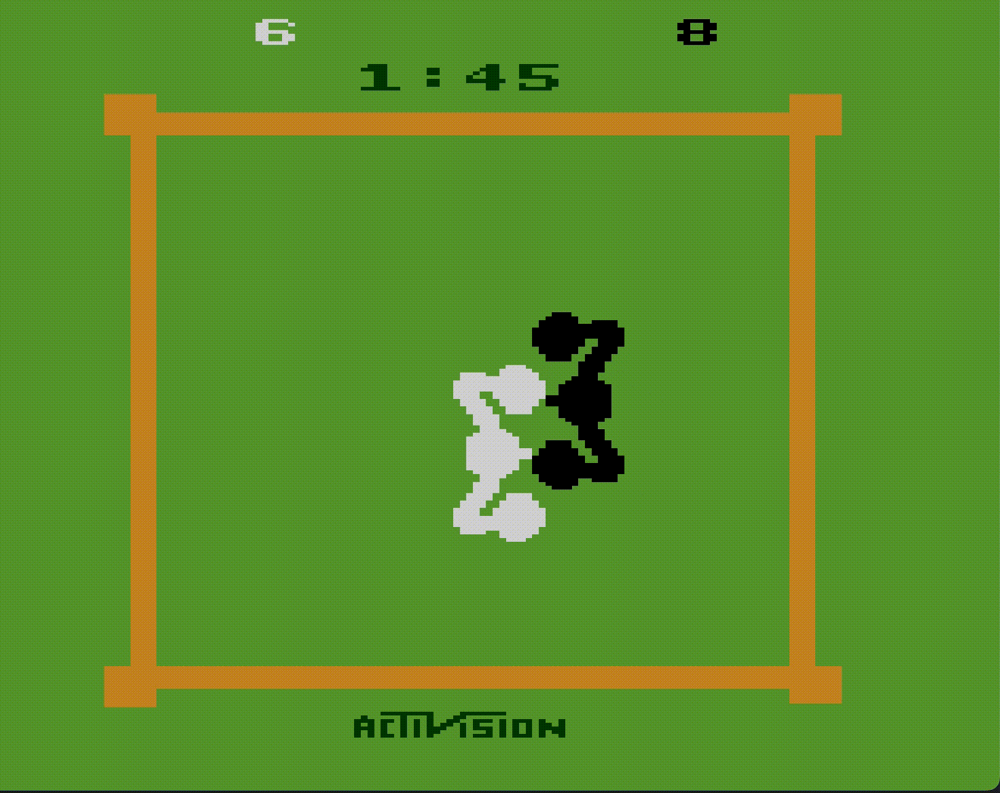

# COMP 3004 Designing Intelligent Agents Atari Boxing Coursework
This repository contains my courework for the DIA 2022 coursework. This repo contains two programs that can be run which can train reinforcement learning models for Atari Boxing and can then evaluate them along with other hardcoded models.

## Prerequisites
The programs were created to be run with Python 3.9.6 so this is the recommended version.

This project mainly uses the Atari Gym environment that can be installed via pip via the following guide [here](https://gym.openai.com/docs/). The version of gym this program used was 0.21.0.

Additionally the following packages need to be installed by `pip install` or another means:

| Package | Version |
| --- | ----------- |
| atari-py | 0.2.9 |
| gym | 0.21.0 |
| matplotlib | 3.4.3 |
| tensorboard | 2.8.0 |
| stable-baselines3 | 1.5.0 |

This should be all packages but some dependancies may have been missed or updated so please install these via `pip install` or contact me if you are having more trouble at psyam22@nottingham.ac.uk.

## Model Choice

Numerous models have been created for analysis already and have be listed below:

| Agent | Description |
| --- | ----------- |
| Random | Agent that makes random moves |
| ARRA | Hardcoded agent that utilises a combo of actions |
| SARRA | Variation of ARRA with more movement |
| A2C | Reinforcement Learned model based on A2C algorithm (5 million iterations) |
| PPO | Reinforcement Learned model based on PPO algorithm (1 million iterations) |

This list may be expanded in the future if more models are developed

## Analysis Program
The main experimental analysis program is located in `main.py` and can be run from the command line via `python3 main.py`

Please note there are several command line arguements that need to be passed and further optional ones which are visualised in the table below:

| Argument Name | Command | Description | Optional | Default |
| --- | --- | --- | --- | --- |
| Agent | -a NAME | Name of agent to evaluate | No | X |
| Number of Runs | -n NUMBER |  Number of experiments to run | Yes | 10 |
| Is Silent | -s BOOL | Should display individual experiment results | YES | True |
| Display Screen | -d BOOL | Should render the game | Yes | False

These can then be chained together to run an analysis. If you are struggling `--help` can also be used to see the various options available.

For example, to run 1000 experiments of the random agent with no rendering, one would run:

`python3 main.py -a "random" -n 1000`

Currently in terms of agent options, the following agents are available:

| Agent Name | Value |
| ---        | ---   |
| Random     | random|
| ARRA       | ARRA  |
| SARRA      | SARRA |
| A2C        | rlA2C |
| PPO        | rlPPO |

## Training Program

The training program can be found in `mainrltrain.py` and can be used to train various reinforcement learning models and save them. Note, this is less flushed out as the main program for now due to time constraints of training models.

To train a model simply run:

`python3 mainrltrain.py`

In order to configure what model is trained currently the only way to do this is to manually modify the `mainrltrain.py` file with the new model and values you wish to run it with.

To view the logs from the training, they are sent to the `./TrainingInfo/tensorboard_logs` directory and can be seen easily if using visual studio code via running command shift p and then run `Python: Launch Tensorboard` and click use current directory and it should find all logs been run.
